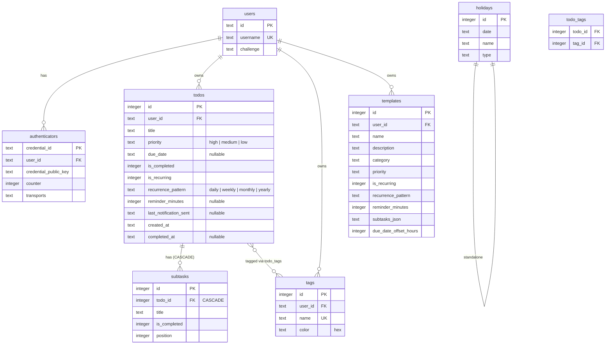
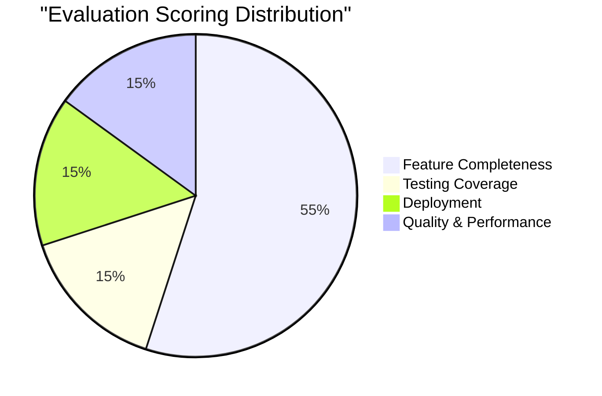
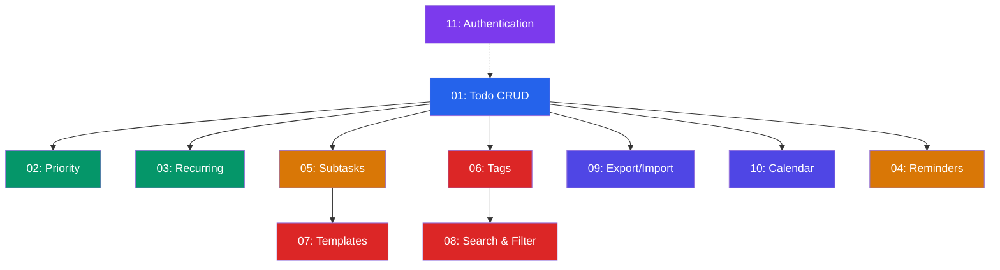

# Todo App – Context & Environment Document

> **Purpose:** This document establishes the complete project context, environment specifications, architectural decisions, and evaluation alignment for the Todo App. It is derived from the [README.md](file:///d:/Trainings/AI-SDLC/SDLCDay2/AI-SDLC-Workshop-Day1n2/README.md) requirements and mapped against the [EVALUATION.md](file:///d:/Trainings/AI-SDLC/SDLCDay2/AI-SDLC-Workshop-Day1n2/EVALUATION.md) scoring rubric (200 points total).

---

## 1. Project Overview

| Attribute | Detail |
|-----------|--------|
| **Application** | Full-stack Todo App with WebAuthn (Passkey) authentication |
| **Reference** | https://ai-sdlc-workshop-day1-production.up.railway.app/login |
| **Framework** | Next.js 16 (App Router) |
| **Runtime** | Node.js 20+ |
| **Database** | SQLite via `better-sqlite3` (file: `todos.db` in project root) |
| **Authentication** | WebAuthn / Passkeys (passwordless) via `@simplewebauthn` |
| **Timezone** | Singapore (`Asia/Singapore`) — **mandatory for all date/time operations** |
| **Testing** | Playwright E2E tests with virtual WebAuthn authenticators |
| **Deployment Target** | Railway (recommended) or Vercel |

---

## 2. Technology Stack

### Core Dependencies

| Layer | Technology | Version / Notes |
|-------|-----------|-----------------|
| Frontend | React | 19 |
| Framework | Next.js | 16 (App Router, async `params`) |
| Styling | Tailwind CSS | 4 |
| Database | better-sqlite3 | Synchronous SQLite — **no async/await for DB ops** |
| Auth (Server) | @simplewebauthn/server | WebAuthn challenge/verify |
| Auth (Client) | @simplewebauthn/browser | Browser authenticator interaction |
| Session | JWT | HTTP-only cookie, 7-day expiry |
| Testing | Playwright | E2E with virtual authenticators |
| Timezone | Custom `lib/timezone.ts` | `getSingaporeNow()`, `formatSingaporeDate()` |

### Dev Tooling

| Tool | Command |
|------|---------|
| Dev Server | `npm run dev` (port 3000) |
| Production Build | `npm run build` |
| Production Start | `npm start` |
| Lint | `npm run lint` (ESLint) |
| E2E Tests | `npx playwright test` |
| Test UI | `npx playwright test --ui` |
| Test Report | `npx playwright show-report` |
| Seed Holidays | `npx tsx scripts/seed-holidays.ts` |
| Inspect DB | `sqlite3 todos.db` |

---

## 3. Architecture & Key Patterns

### 3.1 Project Structure

```
todo-app/
├── .github/
│   ├── copilot-instructions.md        ← AI agent instructions
│   └── PRPs/                          ← Not used at runtime (reference only)
├── PRPs/
│   ├── README.md                      ← PRP index (11 feature specs)
│   ├── 01-todo-crud-operations.md
│   ├── 02-priority-system.md
│   ├── 03-recurring-todos.md
│   ├── 04-reminders-notifications.md
│   ├── 05-subtasks-progress.md
│   ├── 06-tag-system.md
│   ├── 07-template-system.md
│   ├── 08-search-filtering.md
│   ├── 09-export-import.md
│   ├── 10-calendar-view.md
│   └── 11-authentication-webauthn.md
├── app/
│   ├── page.tsx                       ← Main UI (~2200 lines, 'use client')
│   ├── layout.tsx                     ← Root layout
│   ├── calendar/
│   │   └── page.tsx                   ← Calendar view
│   ├── login/
│   │   └── page.tsx                   ← Login/Register page
│   └── api/                           ← RESTful API routes
│       ├── auth/                      ← WebAuthn endpoints
│       ├── todos/                     ← Todo CRUD + export/import
│       ├── subtasks/                  ← Subtask management
│       ├── tags/                      ← Tag CRUD
│       ├── templates/                 ← Template CRUD + use
│       ├── holidays/                  ← Singapore holidays
│       └── notifications/             ← Reminder check endpoint
├── lib/
│   ├── db.ts                          ← Database schema + all CRUD (~700 lines)
│   ├── auth.ts                        ← Session management (JWT)
│   ├── timezone.ts                    ← Singapore timezone utilities
│   └── hooks/
│       └── useNotifications.ts        ← Browser notification hook
├── middleware.ts                       ← Route protection (/ and /calendar)
├── tests/
│   ├── helpers.ts                     ← Reusable test utilities
│   └── *.spec.ts                      ← Feature-specific E2E tests
├── scripts/
│   └── seed-holidays.ts              ← Holiday seeder
├── package.json
├── next.config.ts
├── playwright.config.ts
└── todos.db                           ← SQLite database file (auto-created)
```

### 3.2 Architectural Decisions

| Decision | Rationale |
|----------|-----------|
| **Monolithic client component** (`app/page.tsx` ~2200 lines) | Simplicity over modularity — all todo features in one file |
| **Synchronous DB operations** | `better-sqlite3` is synchronous — no promises needed |
| **API Routes for all DB access** | Client components never import `lib/db.ts` directly |
| **JWT sessions via HTTP-only cookies** | Security — no localStorage tokens |
| **Singapore timezone mandatory** | All dates must use `lib/timezone.ts` — never `new Date()` |
| **`params` is async in Next.js 16** | Always use `const { id } = await params` in API routes |

### 3.3 API Route Pattern

Every API route follows this exact structure:

```typescript
export async function GET/POST/PUT/DELETE(request: NextRequest) {
  const session = await getSession();
  if (!session) return NextResponse.json({ error: 'Not authenticated' }, { status: 401 });
  
  // For routes with params:
  const { id } = await params;  // params is a Promise in Next.js 16
  
  // Use session.userId for all DB queries
}
```

---

## 4. Feature Inventory (11 Features)

Each feature maps directly to a 10-point evaluation item (110 points total).

### Phase 1 — Foundation

| # | Feature | Key Capabilities | Evaluation Points |
|---|---------|-------------------|-------------------|
| 01 | **Todo CRUD** | Create/Read/Update/Delete, priority, due date, sections (Overdue/Active/Completed), optimistic UI | 10 |
| 02 | **Priority System** | High/Medium/Low, color badges (red/yellow/blue), auto-sort, filter dropdown | 10 |

### Phase 2 — Core Features

| # | Feature | Key Capabilities | Evaluation Points |
|---|---------|-------------------|-------------------|
| 03 | **Recurring Todos** | Daily/Weekly/Monthly/Yearly, next instance on completion, metadata inheritance | 10 |
| 04 | **Reminders & Notifications** | 7 timing options, browser notifications, 30s polling, duplicate prevention | 10 |
| 05 | **Subtasks & Progress** | Unlimited subtasks, checkboxes, progress bar (X/Y completed Z%), cascade delete | 10 |

### Phase 3 — Organization

| # | Feature | Key Capabilities | Evaluation Points |
|---|---------|-------------------|-------------------|
| 06 | **Tag System** | CRUD tags with colors, many-to-many, filter by tag, badge click to filter | 10 |
| 08 | **Search & Filtering** | Real-time, case-insensitive, title + tag search, combined AND filters, debounced (300ms) | 10 |

### Phase 4 — Productivity

| # | Feature | Key Capabilities | Evaluation Points |
|---|---------|-------------------|-------------------|
| 07 | **Template System** | Save/use templates, subtask serialization (JSON), due date offset, categories | 10 |
| 09 | **Export/Import** | JSON with version field, ID remapping, relationship preservation, tag conflict resolution | 10 |
| 10 | **Calendar View** | Monthly grid, Singapore holidays, todo visualization, day modal, URL state (`?month=YYYY-MM`) | 10 |

### Phase 5 — Infrastructure

| # | Feature | Key Capabilities | Evaluation Points |
|---|---------|-------------------|-------------------|
| 11 | **Authentication (WebAuthn)** | Passkey register/login, JWT sessions (7-day), middleware protection, logout | 10 |

---

## 5. Database Schema

### Tables & Relationships



### Key Constraints

- `subtasks` → `todos` with **CASCADE DELETE**
- `todo_tags` many-to-many junction table
- Tags are **unique per user** (name)
- All timestamps in **Singapore timezone**

---

## 6. Complete API Surface

### Authentication (`/api/auth/`)

| Method | Endpoint | Purpose |
|--------|----------|---------|
| POST | `/api/auth/register-options` | Get WebAuthn registration challenge |
| POST | `/api/auth/register-verify` | Verify registration response |
| POST | `/api/auth/login-options` | Get WebAuthn login challenge |
| POST | `/api/auth/login-verify` | Verify login response |
| POST | `/api/auth/logout` | Clear session cookie |
| GET | `/api/auth/me` | Get current user info |

### Todos (`/api/todos/`)

| Method | Endpoint | Purpose |
|--------|----------|---------|
| POST | `/api/todos` | Create todo |
| GET | `/api/todos` | List all user's todos |
| GET | `/api/todos/[id]` | Get single todo |
| PUT | `/api/todos/[id]` | Update todo (incl. recurring completion) |
| DELETE | `/api/todos/[id]` | Delete todo (cascades) |
| GET | `/api/todos/export` | Export all data as JSON |
| POST | `/api/todos/import` | Import JSON data |

### Subtasks (`/api/todos/[id]/subtasks/` & `/api/subtasks/`)

| Method | Endpoint | Purpose |
|--------|----------|---------|
| POST | `/api/todos/[id]/subtasks` | Add subtask to todo |
| PUT | `/api/subtasks/[id]` | Update subtask |
| DELETE | `/api/subtasks/[id]` | Delete subtask |

### Tags (`/api/tags/` & `/api/todos/[id]/tags/`)

| Method | Endpoint | Purpose |
|--------|----------|---------|
| GET | `/api/tags` | List user's tags |
| POST | `/api/tags` | Create tag |
| PUT | `/api/tags/[id]` | Update tag |
| DELETE | `/api/tags/[id]` | Delete tag |
| POST | `/api/todos/[id]/tags` | Assign tag to todo |
| DELETE | `/api/todos/[id]/tags` | Remove tag from todo |

### Templates (`/api/templates/`)

| Method | Endpoint | Purpose |
|--------|----------|---------|
| GET | `/api/templates` | List user's templates |
| POST | `/api/templates` | Create template |
| PUT | `/api/templates/[id]` | Update template |
| DELETE | `/api/templates/[id]` | Delete template |
| POST | `/api/templates/[id]/use` | Create todo from template |

### Other

| Method | Endpoint | Purpose |
|--------|----------|---------|
| GET | `/api/holidays` | Get Singapore holidays |
| GET | `/api/notifications/check` | Check for due reminders |

---

## 7. Development Environment Setup

### Prerequisites

| Requirement | Minimum Version |
|-------------|-----------------|
| Node.js | 20.x+ |
| npm | 10.x+ |
| Browser | Chrome/Edge (recommended for WebAuthn) |
| OS | Windows / macOS / Linux |

### Initial Setup

```bash
# 1. Clone repository
git clone <repo-url> todo-app
cd todo-app

# 2. Install dependencies
npm install

# 3. Start development server
npm run dev
# → http://localhost:3000

# 4. Seed holidays (optional but needed for calendar)
npx tsx scripts/seed-holidays.ts
```

### Environment Variables

| Variable | Description | Dev Default | Production |
|----------|-------------|-------------|------------|
| `JWT_SECRET` | JWT signing secret | auto-generated | Random 32+ char string |
| `RP_ID` | WebAuthn Relying Party ID | `localhost` | Production domain |
| `RP_NAME` | WebAuthn Relying Party Name | `Todo App` | App name |
| `RP_ORIGIN` | WebAuthn origin URL | `http://localhost:3000` | `https://your-domain.com` |
| `RAILWAY_VOLUME_MOUNT_PATH` | DB storage path (Railway) | N/A | `/app/data` |

### `.env.example`

```env
JWT_SECRET=your-secret-key-minimum-32-characters
RP_ID=localhost
RP_NAME=Todo App
RP_ORIGIN=http://localhost:3000
```

---

## 8. Testing Strategy

### Playwright Configuration

| Setting | Value |
|---------|-------|
| Browser | Chromium (with virtual WebAuthn authenticator) |
| Timezone | `Asia/Singapore` |
| Base URL | `http://localhost:3000` |
| WebAuthn | Virtual authenticator via Chrome DevTools Protocol |

### Test Organization (by Feature)

| Test File | Feature | Evaluation Coverage |
|-----------|---------|---------------------|
| `01-authentication.spec.ts` | WebAuthn registration/login/logout | Feature 11 |
| `02-todo-crud.spec.ts` | Create, edit, toggle, delete | Feature 01 |
| `03-priority.spec.ts` | Priority levels, sorting, filtering | Feature 02 |
| `04-recurring.spec.ts` | Recurring patterns, next instance | Feature 03 |
| `05-reminders.spec.ts` | Reminder setting, notification check | Feature 04 |
| `06-subtasks.spec.ts` | Subtask CRUD, progress bar | Feature 05 |
| `07-tags.spec.ts` | Tag CRUD, assignment, filtering | Feature 06 |
| `08-templates.spec.ts` | Save/use template, subtask preservation | Feature 07 |
| `09-search-filter.spec.ts` | Text search, combined filters | Feature 08 |
| `10-export-import.spec.ts` | JSON export/import, data integrity | Feature 09 |
| `11-calendar.spec.ts` | Calendar display, navigation, holidays | Feature 10 |

### Test Helpers (`tests/helpers.ts`)

Reusable methods:
- `createTodo(title, options)` — Create a todo with optional metadata
- `addSubtask(todoId, title)` — Add subtask to a todo
- `createTag(name, color)` — Create a tag
- Registration & login flows with virtual authenticator

---

## 9. Evaluation Alignment Matrix

> Maps the [EVALUATION.md](file:///d:/Trainings/AI-SDLC/SDLCDay2/AI-SDLC-Workshop-Day1n2/EVALUATION.md) scoring rubric to concrete implementation targets.

### Scoring Breakdown (200 points total)



### Category 1: Feature Completeness (0–110 points)

| Feature | Points | Key Requirements |
|---------|--------|-----------------|
| 01 Todo CRUD | 10 | 6 API endpoints, Singapore TZ validation, Overdue/Active/Completed sections, optimistic UI |
| 02 Priority | 10 | 3 levels, color badges, auto-sort, filter |
| 03 Recurring | 10 | 4 patterns, next instance, metadata inheritance, TZ-aware |
| 04 Reminders | 10 | 7 timing options, browser notifications, 30s polling, dedup |
| 05 Subtasks | 10 | CRUD, progress bar, cascade delete |
| 06 Tags | 10 | Many-to-many, color picker, filter by badge click |
| 07 Templates | 10 | Save/use, subtask JSON, due date offset, categories |
| 08 Search | 10 | Real-time, case-insensitive, title+tag, AND filters |
| 09 Export/Import | 10 | JSON format, ID remap, relationship preservation |
| 10 Calendar | 10 | Monthly grid, holidays, todo vis, URL state |
| 11 Auth | 10 | WebAuthn, JWT sessions, middleware, logout |

> **Partial implementation** = 5 points per feature

### Category 2: Testing Coverage (0–30 points)

| Area | Points | Targets |
|------|--------|---------|
| E2E Tests (Playwright) | 15 | All 11 test files, pass 3 consecutive runs |
| Unit Tests | 10 | DB CRUD, date calcs, progress calc, ID remap, validation |
| Manual Testing | 5 | All core flows verified manually |

### Category 3: Deployment (0–30 points)

| Area | Points | Targets |
|------|--------|---------|
| Successful Deployment | 15 | Railway or Vercel, app accessible via HTTPS |
| Environment Config | 5 | All env vars set, `.env.example` exists |
| Production Testing | 5 | All features work on production URL |
| Documentation | 5 | README updated, deployment instructions, known issues |

### Category 4: Quality & Performance (0–30 points)

| Area | Points | Targets |
|------|--------|---------|
| Code Quality | 10 | ESLint passing, TypeScript strict, no errors, error handling, loading states |
| Performance | 10 | Page load < 2s, TTI < 3s, API < 300ms, search < 100ms, bundle < 500KB |
| Accessibility | 5 | WCAG AA, keyboard nav, screen reader labels, Lighthouse > 90 |
| Security | 5 | HTTP-only cookies, Secure flag, SameSite, prepared statements, CORS |

### Rating Scale

| Score | Rating | Description |
|-------|--------|-------------|
| 180–200 | 🌟 Excellent | Production ready, exceeds expectations |
| 160–179 | 🎯 Very Good | Production ready, meets all requirements |
| 140–159 | ✅ Good | Mostly complete, minor issues |
| 120–139 | ⚠️ Adequate | Core features work, needs improvement |
| 100–119 | ❌ Incomplete | Missing critical features |
| < 100 | ⛔ Not Ready | Significant work needed |

---

## 10. Deployment Configuration

### Railway (Recommended)

> Railway is recommended because it supports **persistent SQLite** via volumes.

| Config | Value |
|--------|-------|
| Builder | Nixpacks |
| Build Command | `npm run build` |
| Start Command | `npm start` |
| Volume Mount | `/app/data` (for `todos.db` persistence) |
| Region | Singapore (`sin1`) preferred |

**DB Path Update** (for Railway volumes):
```typescript
// lib/db.ts
const dbPath = path.join(process.env.RAILWAY_VOLUME_MOUNT_PATH || process.cwd(), 'todos.db');
```

**Config Files Needed:**

```json
// railway.json
{
  "build": {
    "builder": "NIXPACKS",
    "buildCommand": "npm run build"
  },
  "deploy": {
    "startCommand": "npm start",
    "restartPolicyType": "ON_FAILURE",
    "restartPolicyMaxRetries": 10
  }
}
```

```toml
# nixpacks.toml
[phases.setup]
nixPkgs = ["nodejs-18_x"]

[phases.install]
cmds = ["npm ci"]

[phases.build]
cmds = ["npm run build"]

[start]
cmd = "npm start"
```

### Vercel (Alternative)

> [!WARNING]
> SQLite database **resets on each deployment** with Vercel (serverless functions). Consider Vercel Postgres or external DB for persistence.

```json
// vercel.json
{
  "buildCommand": "npm run build",
  "devCommand": "npm run dev",
  "installCommand": "npm install",
  "framework": "nextjs",
  "regions": ["sin1"]
}
```

---

## 11. Critical Constraints & Pitfalls

> [!CAUTION]
> These constraints are non-negotiable and will affect evaluation scores if violated.

| # | Constraint | Details |
|---|-----------|---------|
| 1 | **Singapore timezone** | Never use `new Date()` — always `getSingaporeNow()` from `lib/timezone.ts` |
| 2 | **Next.js 16 async params** | `const { id } = await params` — params is a Promise |
| 3 | **Null coalescing for DB fields** | Always use `?? 0` or `?? null` for potentially undefined fields (e.g., `counter: authenticator.counter ?? 0`) |
| 4 | **Synchronous DB ops** | `better-sqlite3` — no async/await for database queries |
| 5 | **WebAuthn base64 encoding** | Use `isoBase64URL` from `@simplewebauthn/server/helpers` for credential_id |
| 6 | **No direct DB imports in client** | Never import `lib/db.ts` in client components — use API routes |
| 7 | **Recurring todo completion** | Must create next instance with same priority, tags, reminder, recurrence pattern |
| 8 | **Due date validation** | Must be in future (minimum 1 minute from now) |
| 9 | **Tag uniqueness** | Tag names must be unique per user |
| 10 | **Cascade delete** | Deleting a todo must cascade to subtasks and tag associations |

---

## 12. Implementation Priority (Feature Dependencies)



### Recommended Implementation Order

| Phase | Features | Rationale |
|-------|----------|-----------|
| **Phase 1 — Foundation** | 01 Todo CRUD, 02 Priority | Base data model and UI |
| **Phase 2 — Core** | 03 Recurring, 04 Reminders, 05 Subtasks | Depends on todo model |
| **Phase 3 — Organization** | 06 Tags, 08 Search & Filtering | Tags enable search by tag |
| **Phase 4 — Productivity** | 07 Templates, 09 Export/Import, 10 Calendar | Depends on subtasks/tags |
| **Phase 5 — Infrastructure** | 11 Authentication | Can be developed in parallel or last |

---

## 13. Success Criteria Summary

### MVP (Minimum Pass)
- [ ] All 11 core features implemented and working
- [ ] All E2E tests passing (3 consecutive runs)
- [ ] Successfully deployed to Railway or Vercel (HTTPS)
- [ ] WebAuthn authentication working in production
- [ ] Database persisting correctly
- [ ] No critical bugs

### Production Ready
- [ ] All MVP criteria met
- [ ] Performance metrics met (page < 2s, API < 300ms)
- [ ] Accessibility score > 90 (Lighthouse)
- [ ] Security checklist complete
- [ ] Cross-browser testing complete
- [ ] Error handling robust
- [ ] Documentation complete

### Excellent (180+ points)
- [ ] All Production Ready criteria met
- [ ] Code coverage > 80%
- [ ] Lighthouse > 90 (all categories)
- [ ] Sub-second API responses
- [ ] Custom domain configured
- [ ] Monitoring/analytics setup
- [ ] SEO optimized

---

**Document Created:** 2026-05-22
**Source Documents:** [README.md](file:///d:/Trainings/AI-SDLC/SDLCDay2/AI-SDLC-Workshop-Day1n2/README.md), [EVALUATION.md](file:///d:/Trainings/AI-SDLC/SDLCDay2/AI-SDLC-Workshop-Day1n2/EVALUATION.md), [copilot-instructions.md](file:///d:/Trainings/AI-SDLC/SDLCDay2/AI-SDLC-Workshop-Day1n2/.github/copilot-instructions.md), [PRPs/README.md](file:///d:/Trainings/AI-SDLC/SDLCDay2/AI-SDLC-Workshop-Day1n2/PRPs/README.md)
